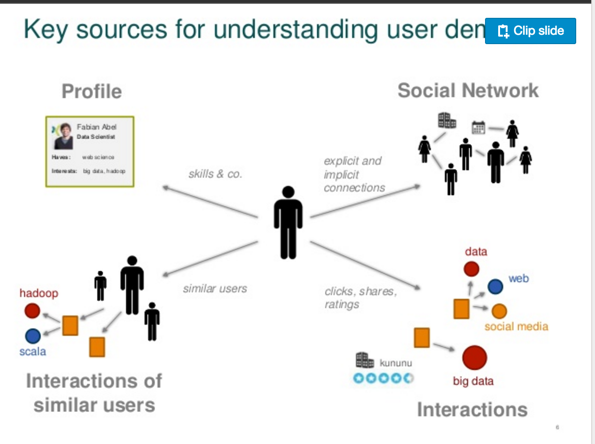
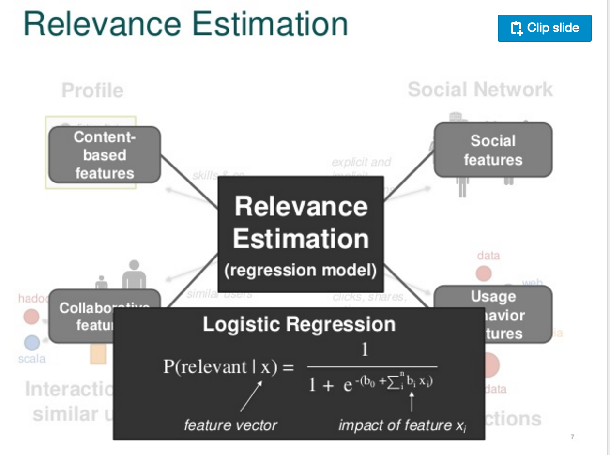

# Week 1 Discussion - Scenario Design

## Dice.com: Matching job hunters with companies

Your task for the first discussion is to analyze an existing recommender system that you find interesting.  You should:

1. Perform a Scenario Design analysis as described below.  Consider whether it makes sense for your selected recommender system to perform scenario design twice, once for the organization (e.g. Amazon.com) and once for the organization's customers.
2. Attempt to reverse engineer what you can about the site, from the site interface and any available information that you can find on the Internet or elsewhere.
3. Include specific recommendations about how to improve the site's recommendation capabilities going forward.

## Introduction

Dice.com is part of a new breed of job hunting sites that blur the line between social networking and job hunting. Networking has been an important part of the job hunt since before online social networks existed, but only recently have companies began bridging these two worlds.

Job hunting sites such as these can be seen as having two customers: both the job hunter and the company with an open position. Depending on the business model, either side of these can pay for the service (TheLadders, for instance, charges both job seekers and employers.) It would be worthwhile to consider a scenario analysis for both sides of this recommendation engine.

## Scenario Design: Job Seeker

# Who are your target users? 

Target users can be divided into two major types: 

- Immediate job seekers: These people are going to these sites for the express purpose of finding a job. They may be unemployed or just so dissatisfied with their current job that they have an immediate need for new employment. 

- Career planners: These people might be a little dissatisfied in their jobs, but don't have an immediate need to leave.

# What are their key goals?

All job seekers ideally would like the same thing: a career that suits their skills and interests. An immediate job hunter has a very straight forward goal: They would like to find the best job out there for them. 

Career planners have slightly different goals. They have a long term goal of career development, and most of the time, this will eventually involve switching to another company. They may also be looking to improve their future prospects by learning new skills, and keeping updated on the industry. 

# How can you help them acheive their goals?

Solving the problem for job seekers is more straight forward. There is a set of people with certain skills and certain desires,  and a set of open jobs. You can help out these job seekers by matching their skills and desires to the set of open jobs.

How you can help users acheive their goals is a bit more complicated with career planners. Career planners would eventually like to be placed with the right job, but have time on their side. Rather than getting the best job now, they would like to get highly tuned recommendations as jobs come up. In the reverse engineering section, I'll mention how this can lead to different information being used in the process.

## Scenario Design: Job Seeker

# Who are your target users? 

On the flip side of things, your target users are companies. Companies cannot be divided as easily into the same categories as potential employees, they concurrently have the need for both types of prospects.

# What are their key goals.

A company has multiple positions. In the short term, they may have some vacancies. In the long term, they will have rolling vacancies, and would ideally like to have a rolling pipeline of prospects. Framed this way, these two needs correspond to the two types of job hunters.

# How can you help them acheive their goals?

Similarly to the situation with prospects, there are both immediate and long term goals. The one difference is a company will always have rolling needs, and therefore will be more likely to think in terms of long term relationships. An employee may only use job sites during bouts of unemployment, but a company has more consistant staffing needs. They would prefer to maintain a pipeline of prospects in case the need for a prospect arises.

In addition to being matched to short term positions, companies may want to be matched to career builders even if no open position exists. Perhaps a company can be matched with a junior employee currently employed, who with a bit more experience would be qualified for a senior position in their company should the need arise. Or, companies looking for junior employees could be paired with graduating college students.

## Reverse Engineer the Recommendation System

Xing researcher Fabian Abel put together a [series of slides](http://www.slideshare.net/fobabel/whats-wrong-with-recruiterjohn-a-nontrivial-recommender-challenge) on how to solve the problem of recommending jobs to prospects. It details the features that they personally look at when evaluating a match:

These two slides detail the features that go into their matching algorithm. "Profile" is what you would classically think of as being in a recommendation system for immediate job seekers. A seeker has a certain set of skills, and based on those skills and their desires, can be recommended the best open positions. Many sites have been fine tuning how they list their skills, similar to Netflix's fine tuning of movie types. Data can be gathered about which skills can be grouped together (programming languages, for example,) and help further inform the recommendation system.

The other features seem more like a social network, and correspond more to the long term search goals of companies and individuals. Individuals can build their networks in a more casual way, and tap into that network when they need a job (or to allow themselves to be open to their dream job.) Similarly, companies can obtain followings of future prospects.

Dice also has a social network aspect to their site, but have another strategy in matching prospects and jobs long term. [This article](http://www.theverge.com/2012/9/18/3351970/dice-holdings-geeknet-slashdot-careers-news) explains how Dice acquired a content company with the purpose of improving its matching algorithm. In terms of the slides above, this would fall into the category of social network matching. But, focusing on content makes it more likely that long term prospects stay on the site, and give Dice more information about their career prosepcts. If a prospect who has been a long term reader of content on Dice starts looking for a job, Dice can use the content they've read to make better matches for companies. Outside of tech, lots of skills can be thought of as "soft," and might be difficult to really find. Clustering users by content can help uncover these aspects of employee networks.

## Recommendations for moving forward

I think education can be brought into this recommendation system to help improve matches between employees and companies. I mentioned above that some companies may find junior prospects at other companies worth "keeping an eye on." Companies could associate jobs with education goals (such as coursera courses), and encourage prospects to grow the skills they find valuable. These skills would be valuable to the prospects whether or not they choose to work at this company, and might serve as the added incentive to devote their free time towards learning something new.